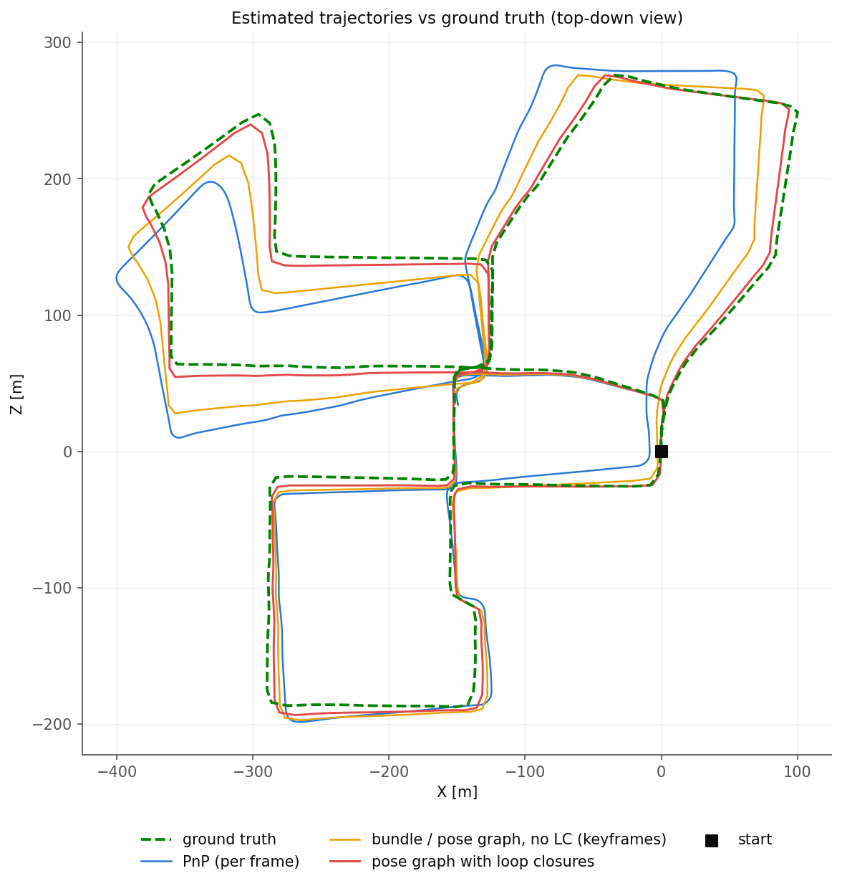
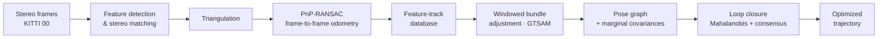
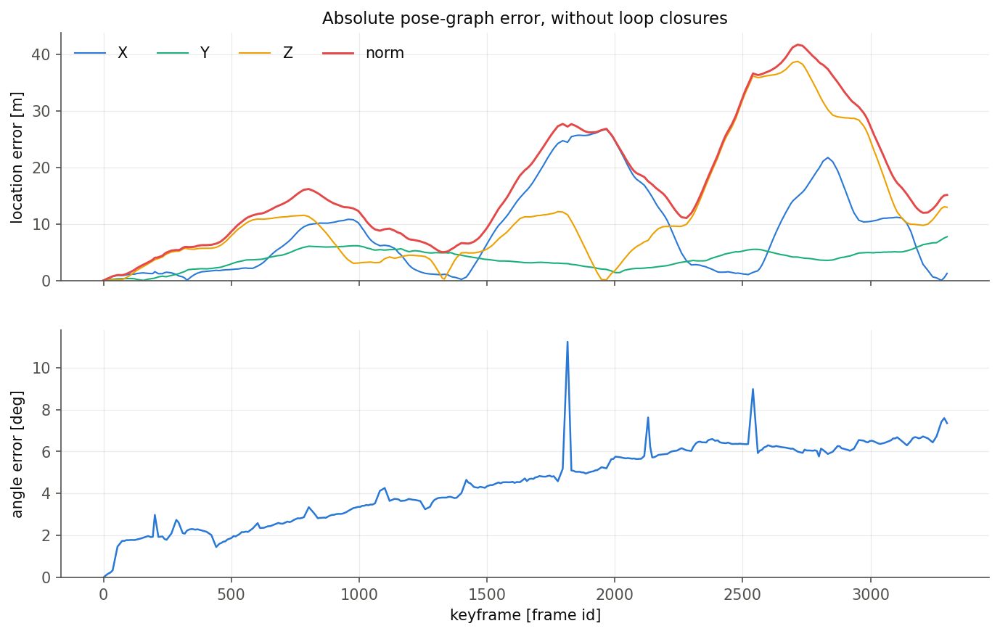
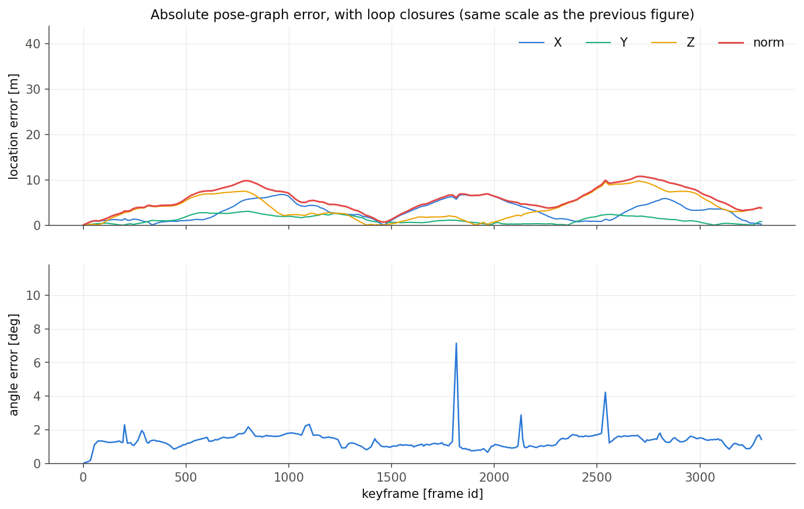
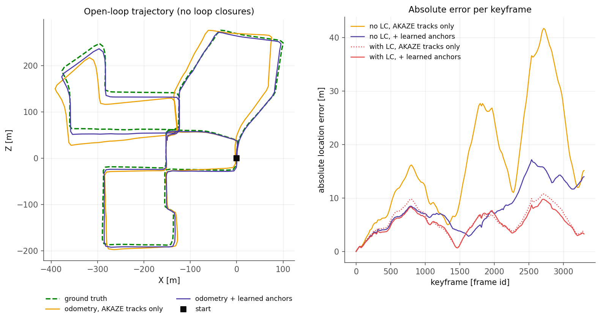

# Stereo Visual SLAM on KITTI

A from-scratch **stereo visual-odometry and SLAM pipeline** that recovers the
trajectory of [KITTI](https://www.cvlibs.net/datasets/kitti/eval_odometry.php)
odometry sequence 00 (~3,300 stereo frames, ≈2.5 km) from images alone —
feature tracking, PnP-RANSAC odometry, windowed bundle adjustment, pose-graph
optimization, and loop closure. A final deep-learning front-end study adds a
wide-baseline anchor step that **halves the open-loop drift**.


<p align="center">
  
</p>
<p align="center"><em>Bird's-eye trajectories on KITTI 00: frame-to-frame PnP
drifts, bundle adjustment fixes the local shape, and loop closure snaps the
loops back onto the ground truth (green).</em></p>

---

## What it does

Estimating a vehicle's trajectory from its own sensors is a core capability for
autonomous driving and robotics: GPS is unreliable in urban canyons and
tunnels, wheel odometry drifts, and a camera is cheap and information-rich. This
project implements a full stereo SLAM pipeline that:

1. Estimates **frame-to-frame motion** with PnP-RANSAC over triangulated stereo
   features,
2. Refines it with **windowed bundle adjustment** over multi-frame feature
   tracks (GTSAM),
3. Summarizes the result in a **pose graph** with marginalized relative-motion
   covariances, and
4. Corrects accumulated drift with **loop closures** found by a Mahalanobis
   pre-filter and verified by consensus matching.



## Results

Measured on KITTI sequence 00 (318 keyframes, 317 bundle windows, 12 loop
closures detected). "Absolute location error" is the distance between each
estimated keyframe and its ground-truth pose.

| Configuration | Median error | Max error |
| --- | --- | --- |
| Pose graph, **no** loop closure | 14.5 m | 41.7 m |
| Pose graph **with** loop closure | **5.5 m** | **10.8 m** |
| Deep-learning anchor front-end, no loop closure | 7.2 m | 17.2 m |

Rotation stays tight throughout — median per-keyframe rotation error below
0.08°. Loop closure alone gives a **2.6× reduction** in median position error;
the deep-learning anchor step independently halves the open-loop drift
(14.5 m → 7.2 m) before any loop closure.

<p align="center">
  
  
</p>
<p align="center"><em>Absolute location error along the sequence, before (left)
and after (right) loop closure.</em></p>

## Deep-learning front-end study

The odometry drift on KITTI 00 is dominated by **rotation error concentrated in
fast turns**, where frame-by-frame tracks "slide" systematically and bundle
adjustment cannot see the bias. The study replaces the trusted-but-drifting
frame chain with a **direct wide-baseline constraint**: the first and last
keyframe of each bundle window are matched in a single hop using a learned
matcher (LoFTR + ZNCC stereo, and SuperPoint + LightGlue), and every match is
injected as an extra 3D landmark ("anchor") that out-votes the biased tracks.

Applied to all 317 windows, this halves the open-loop trajectory drift (median
**14.5 m → 7.2 m**). The winning configuration was selected from a search over
~90 variants; the code lives in [`code/deep_frontend/`](code/deep_frontend)
and is fully self-contained — it adds no changes to the core pipeline modules.

<p align="center">
  
</p>

## The pipeline, stage by stage

The pipeline is built as seven progressive stages. Each is a standalone entry
point that only *uses* the shared library modules:

| # | Stage | Entry point |
| --- | --- | --- |
| 1 | Feature detection, matching, ratio test | [`demo_feature_matching.py`](code/demo_feature_matching.py) |
| 2 | Rectified-stereo outlier rejection & triangulation | [`demo_triangulation.py`](code/demo_triangulation.py) |
| 3 | PnP-RANSAC relative motion, consensus tracking | [`run_visual_odometry.py`](code/run_visual_odometry.py) |
| 4 | Multi-frame feature-tracking database & statistics | [`run_feature_tracking.py`](code/run_feature_tracking.py) |
| 5 | Windowed bundle adjustment (GTSAM) | [`run_bundle_adjustment.py`](code/run_bundle_adjustment.py) |
| 6 | Pose graph from bundle relatives | [`run_pose_graph.py`](code/run_pose_graph.py) |
| 7 | Loop closure | [`run_loop_closure.py`](code/run_loop_closure.py) |

## Repository layout

```
.
├── code/
│   ├── dataset.py            # KITTI I/O: images, calibration, GT poses
│   ├── features.py           # detection, matching, rectified-stereo filter, consensus
│   ├── geometry.py           # triangulation, projection, extrinsic composition
│   ├── pnp.py                # PnP solving + four-view RANSAC loop
│   ├── tracking_database.py  # the feature-track database (TrackingDB)
│   ├── bundle.py             # keyframe selection, bundle windows, GTSAM helpers
│   ├── loop_closure.py       # Mahalanobis scoring, consensus match, mini-bundle
│   ├── plot.py               # shared 3D-world plotting conventions
│   ├── project_figures.py    # renders the summary figures
│   ├── demo_*.py, run_*.py    # the seven stage entry points (matching → loop closure)
│   └── deep_frontend/        # deep-learning front-end study (self-contained)
├── dataset/                  # KITTI data — not tracked (see below)
└── docs/                     # rendered summary figures (docs/project_figures/)
```

## Getting started

### 1. Environment

The pipeline needs Python with OpenCV, GTSAM (Python bindings), NumPy and
Matplotlib. The provided `environment.yml` creates a conda environment named
`slam` with everything the core pipeline needs:

```bash
conda env create -f environment.yml
conda activate slam
```

The optional `deep_frontend/` experiments additionally require `torch`, `kornia`
(LoFTR), and SuperPoint + LightGlue — uncomment those lines in
`environment.yml` before creating the environment.

### 2. Dataset

The KITTI data is **not** included in this repository. Download the
[KITTI odometry grayscale set](https://www.cvlibs.net/datasets/kitti/eval_odometry.php)
and the ground-truth poses, then arrange sequence 00 like this:

```
dataset/
├── sequences/00/
│   ├── image_0/   # left  camera PNGs
│   ├── image_1/   # right camera PNGs
│   └── calib.txt
└── poses/00.txt
```

A different sequence can be selected with the `KITTI_SEQUENCE` environment
variable (defaults to `00`).

### 3. Run

Each stage runs standalone from the `code/` directory:

```bash
cd code
python demo_feature_matching.py   # feature detection & matching
python run_visual_odometry.py     # PnP-RANSAC visual odometry
python run_loop_closure.py        # full pipeline + loop closure
```

The bundle-adjustment, pose-graph and loop-closure stages cache intermediate
results (tracking database, bundle relatives, loop closures) to disk, so the
first run is the slow one.

## Tech stack

- **Python**, **OpenCV** — feature detection (AKAZE/SIFT/ORB), matching, PnP
- **GTSAM** — factor graphs for bundle adjustment and pose-graph optimization
- **NumPy** / **Matplotlib** — numerics and figures
- **PyTorch**, **Kornia (LoFTR)**, **SuperPoint + LightGlue** — the deep-learning
  front-end study

## License

Released under the [MIT License](LICENSE).
